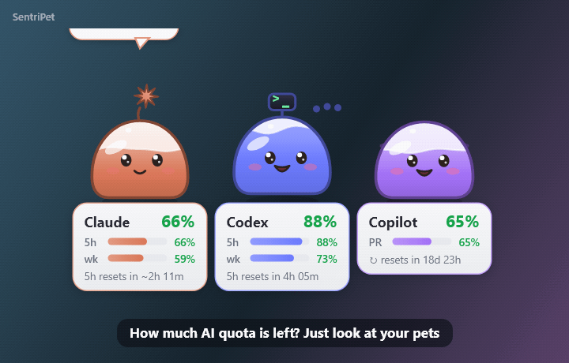
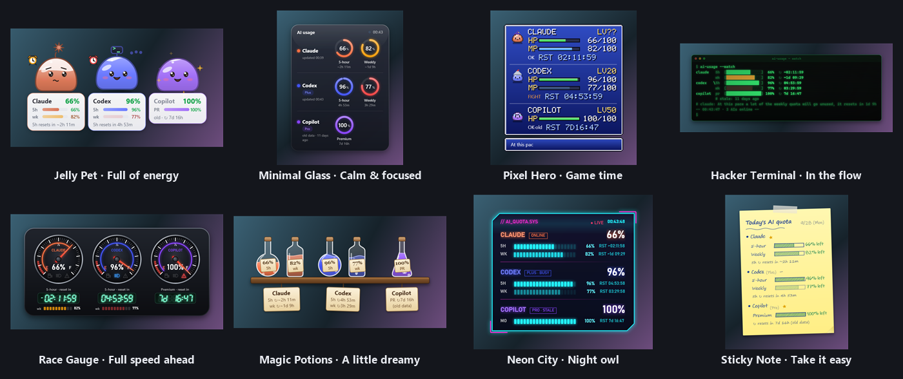
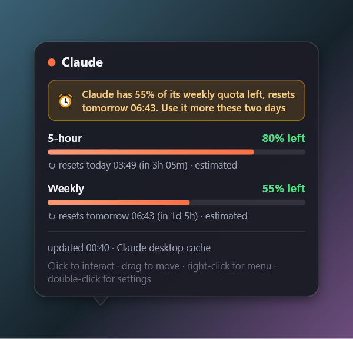
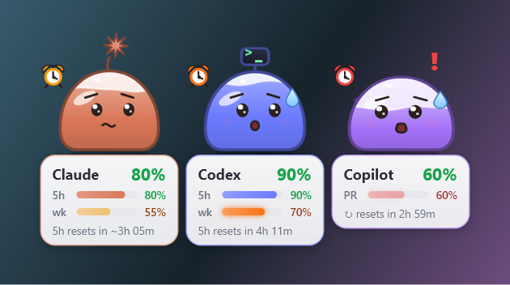
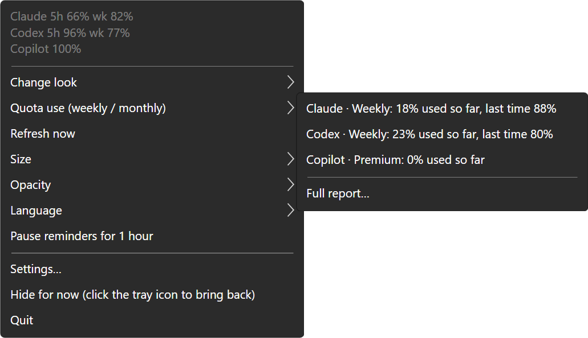
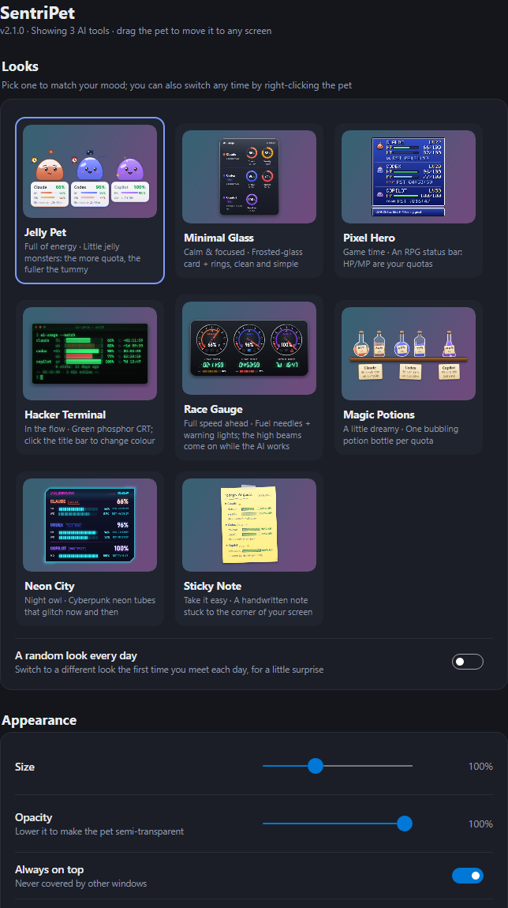

# SentriPet

**English** | [繁體中文](README.zh-TW.md)

[](https://github.com/daven55663/SentriPet-AI/actions/workflows/ci.yml)
[](https://github.com/daven55663/SentriPet-AI/releases/latest)
[](LICENSE)
[](docs/environment.md)

**A desktop pet that shows how much of your AI plan is left — and nudges you to use it before it resets.**

SentriPet finds the AI tools on your computer (Claude, Codex, Copilot…) and turns each one into a little pet
that shows the quota left and when it resets, so you don't keep opening *Settings → Usage*. When a weekly quota
is about to reset with plenty left, the pets get nervous and remind you to use it instead of letting it go to waste.
Runs on **Windows, macOS and Linux**.

<p align="center"></p>

## Why SentriPet

- **See what's left at a glance** — the big number is the shortest quota (e.g. 5 hours), the bars below are the weekly ones, with a reset countdown
- **"Use it before it resets" nudges** — besides warning you when a quota runs low, SentriPet tells you when you're about to *waste* a weekly quota
- **Knows when Claude Code or Codex is done** — or waiting for your OK — and hops up to tell you, so you can do something else meanwhile
- **Forecast and reports** — "at this pace it runs out around 15:40", how much of every past weekly quota you actually used,
  tokens per day, folder and model for the last 7 or 30 days with what they would cost through the API, and a weekly picture to share
- **Fits into your setup** — the remaining % right in the tray / menu-bar icon, a `usage.json` for your scripts or Stream Deck,
  and a transparent page for OBS
- **Eight looks** to match your mood: jelly pets, frosted glass, pixel RPG, hacker terminal, race gauges, magic potions, neon city, sticky note
- **Claude, Codex, Copilot, Ollama** out of the box, anything else through a small JSON plugin
- **Private by design** — reads only the usage numbers the tools keep on your computer; never reads or sends your sign-in credentials
- **Five languages**: English, 繁體中文, 简体中文, 日本語, 한국어 (follows your system language)
- Drag it to any screen; starts at sign-in; hides itself while you watch videos or play in full screen
- Light: about 110 MB of memory; animating costs about 1–4% of one CPU core (measured on the [development machine](docs/environment.md))

## Screenshots

**Eight looks** (right-click the pet → Change look)

<p align="center"></p>

**Hover over a pet** for every quota, its reset time, where the numbers come from and how fresh they are.
**Quota about to expire unused?** The pets get nervous (sweat, alarm clocks, blinking bars) and the card says so.

<p align="center">
  
  
</p>

**Right-click menu and settings** (double-click the pet to open the settings)

<p align="center">
  
  
</p>

**Languages** (right-click menu → Language)

<p align="center"></p>

## Install

### With a package manager (recommended)

**Windows** ([Scoop](https://scoop.sh)) — the pet appears right after the install; update with `scoop update sentripet`.

```
scoop bucket add sentripet https://github.com/daven55663/SentriPet-AI
scoop install sentripet
```

**macOS** ([Homebrew](https://brew.sh)) — installs to Applications; update with `brew upgrade --cask sentripet`.

```
brew tap daven55663/sentripet https://github.com/daven55663/SentriPet-AI
brew install --cask sentripet
```

SentriPet is not signed with an Apple Developer ID; the Homebrew cask removes the download quarantine,
so macOS does not block it as coming from an unidentified developer.

### Download

Get the latest version from **[Releases](https://github.com/daven55663/SentriPet-AI/releases/latest)**:

| System | File | Requires |
|---|---|---|
| Windows | `SentriPet-<version>-win-x64.zip` | Windows 10 / 11 |
| macOS, Apple silicon (M1–M4) | `SentriPet-<version>-osx-arm64.zip` | macOS 12 or later |
| macOS, Intel | `SentriPet-<version>-osx-x64.zip` | macOS 12 or later |
| Linux | `SentriPet-<version>-linux-x64.tar.gz` | x64, X11 or XWayland desktop |

Each package contains everything it needs; you don't have to install .NET.

**Windows**

1. Unzip `SentriPet-<version>-win-x64.zip` into a folder you keep (e.g. `%LOCALAPPDATA%\Programs\SentriPet`).
2. Run `SentriPet.exe`. If Windows says *Windows protected your PC*, click *More info* → *Run anyway* (the program is not code-signed).
3. The pet appears in the bottom-right corner, with a jelly icon in the system tray. SentriPet adds itself to the
   Start menu and starts when you sign in (you can turn that off in *Settings → General*).

**From source** (needs the [.NET 10 SDK](https://dotnet.microsoft.com/download)): `git clone` this repository and run
`install.cmd`; it builds SentriPet, installs it to `%LOCALAPPDATA%\Programs\SentriPet` and starts it (`uninstall.cmd` removes it).

**macOS**

1. Unzip the package for your Mac (`osx-arm64` for Apple silicon, `osx-x64` for Intel) and drag `SentriPet.app` into Applications.
2. **First start**: because the app is not signed with an Apple Developer ID, macOS blocks it. Run this once in Terminal:
   ```
   xattr -dr com.apple.quarantine /Applications/SentriPet.app
   ```
   or open it once (it gets blocked), then go to *System Settings → Privacy & Security*, scroll down and allow SentriPet
   (up to macOS 14 you can also right-click `SentriPet.app` → *Open*). Not needed when you install with Homebrew.
3. The pet appears on your desktop with a jelly icon in the menu bar (not in the Dock). macOS may ask whether SentriPet may send notifications.

**Linux**

```
tar xzf SentriPet-<version>-linux-x64.tar.gz
cd SentriPet-<version>-linux-x64
./install.sh
```

`install.sh` installs to `~/.local/share/sentripet`, adds SentriPet to the application menu and starts it (no root needed).

- The background is transparent on desktops with a compositor (GNOME, KDE, Xfce and most others).
- On GNOME, the tray icon needs the *AppIndicator and KStatusNotifierItem Support* extension; without a tray, use the pet's right-click menu.
- Notifications use `notify-send` (Debian/Ubuntu: `sudo apt install libnotify-bin`).
- There is no Claude desktop app for Linux: to see Claude's usage, turn on *Connect the Claude Code status line* (see the FAQ).

### Update and uninstall

- **Update**: `scoop update sentripet` / `brew upgrade --cask sentripet` (quit SentriPet first: right-click → Quit).
  A downloaded copy: replace the files with the new version (on Linux, run `install.sh` again). Your settings are kept.
- **Uninstall**: turn off *Start at sign-in* in *Settings → General*, right-click the pet → *Quit*, then `scoop uninstall sentripet` /
  `brew uninstall --cask sentripet`, or delete the program and its settings folder (see [File locations](#file-locations)).

## Using SentriPet

### First start

SentriPet looks for AI tools on your computer and every one it finds becomes a pet that says hello. To read the usage it needs:

- **Claude** — the Claude desktop app running (it records the usage every 15 minutes; while you use Claude Code, SentriPet
  estimates the usage in between), or *Settings → AI services → Connect the Claude Code status line* for the official
  numbers straight from Claude Code (the only way on Linux)
- **Codex** — the Codex app, the VS Code extension or the `codex` CLI, signed in with a ChatGPT account
- **Copilot** — Copilot CLI used at least once (it leaves a quota cache)

*Settings → AI services* shows why an AI was not detected; anything else can be added with a [plugin](#other-ais-plugins).

### Controls

| Action | What happens |
|---|---|
| Drag | Move it (snaps to screen edges); the position is remembered |
| Click | The pet answers |
| Hover | Details: every quota, reset times, data source |
| Right-click | Menu: change look (each look with its mood, or leave it to fate), quota use at a glance (bars of the last 8 weekly/monthly windows and the one in progress, with the numbers; *Make this week's summary picture*; *Full report…*), size, opacity, move to screen, language, pause reminders. The switches you rarely change (always on top, click-through, talking, notifications, "use it" nudges, start at sign-in) are in the settings |
| Double-click | Settings |
| Tray / menu-bar icon | Left click shows/hides the pet; right click opens the menu (turn click-through off here). The jelly in the icon is as full as your lowest quota — or, with *Show the remaining % in the tray / menu bar icon*, the icon is that number in its colour; a blue dot means an AI is working |

### Settings

| Section | What you can do |
|---|---|
| Looks | Live previews of the eight looks; a random look every day |
| Appearance | Size, opacity, always on top, hide in full screen, click-through, talking, your own lines, power saving, the remaining % in the tray icon, only in the tray (no pet on the desktop) |
| AI services | What was detected for each AI and the numbers it reads; turn AIs on or off; Codex refresh rate; Claude weekly reset time, the Claude Code status line, "tell me when an AI is done or waiting", live estimate |
| Reminders | Quota notifications, "nudge me to use up weekly quota", quiet hours, warning and critical thresholds |
| Quota use | The last 8 weekly/monthly windows per quota and their average; a notification with the summary at each reset; the usage report |
| For other programs | `usage.json` for your scripts, the local page for OBS ([format and options](docs/usage-json.md)) |
| General | Language, start at sign-in, open the settings / log / program folder |

### Reading the pets

- The **big number** is always the shortest quota (5 hours for Claude and Codex), so it doesn't jump between the 5-hour
  and the weekly quota; the weekly quota is the small bar. The face follows the tightest quota: happy with plenty left,
  sweating when it runs low, asleep when it's used up.
- The line below is the reset countdown and says which quota it is (`5h resets in 2h 11m`).
- A **≈** in front of a number (**~** on Windows) marks an estimate: between two records of the Claude desktop app,
  SentriPet estimates Claude's usage from Claude Code's token counts.
- Numbers that are getting old (say, Copilot CLI not used for a while) are marked *old*.

### "Use it before it resets"

When a weekly or monthly quota is about to reset with a lot left, the pets nudge you to use it. There's no extra text on
the widget: the bar that's about to expire blinks and the pet's face changes; the hover card has the details.

| Until the reset | Left | The pet |
|---|---|---|
| 2 days | 30% or more | The bar blinks slowly; raised eyebrows, glances at its alarm clock; says something about once an hour |
| Last day | 10% or more | Faster blinking, mouth open, sweating, jumps when the alarm rings; about every 25 minutes |
| Last 6 hours | 5% or more | Fast blinking, trembling, the alarm rings non-stop; about every 12 minutes |

Each new level shows one notification (not repeated after a restart). The pets never interrupt while an AI is working, and
don't nudge while the 5-hour quota is used up (you couldn't use it anyway). Turn it off in *Settings → Reminders*.

### "Done or waiting for you" (Claude Code, Codex)

Turn on *Settings → AI services → Tell me when an AI is done or waiting* and the Claude or Codex pet hops up and tells
you when Claude Code finishes a longer task (over 30 seconds, so ordinary chat replies stay quiet), needs your OK, or waits
for your reply — and when Codex finishes a turn. *Also notify* adds a notification. See the FAQ for what it changes.

### Forecast, report and quiet hours

- **Forecast**: while a quota is being used, the hover card shows when it runs out at the pace of the last hour
  (six hours for weekly quotas), if that is before its reset; 45 minutes before, the pet says so once.
- **Quota-use report**: when a weekly or monthly quota resets, the pet sums up how much of it you used
  ("used 82%, only a little wasted!"). *Settings → Quota use* shows the last 8 windows per quota and the average.
- **Quiet hours**: *Settings → Reminders* (e.g. 22:00–08:00, chosen weekdays), or *Pause reminders for 1 hour* in the
  right-click menu. No notifications and nothing said unprompted meanwhile; the pet still answers clicks.

### Usage report and weekly picture

Right-click → *Quota use* → *Full report…* (or *Settings → Quota use → Open the usage report*) opens a window with:

- **Quota use** — each weekly/monthly quota's past windows and the one in progress.
- **Tokens per day** for the last 7 or 30 days, from Claude Code's and Codex's local records (input, output and cache
  reads/writes; only the numbers, the model and the folder name — never the conversation), stacked by AI.
- **Busiest folders** and **models** for the same days.
- **API-equivalent cost** — the tokens multiplied by the official API prices (the price list, with the date it was
  checked and its sources, is built in; a `prices.json` in the settings folder replaces it). It is only a comparison:
  plans and the API count differently, and models missing from the price list are listed, not guessed.

*Make this week's summary picture* saves a 1200 × 675 PNG to `Pictures/SentriPet` — the week's tokens, API-equivalent
cost, favourite model, quota use and a small chart, with your pets — ready to post.

### In the tray, in scripts, on stream

- **The number in the tray**: *Settings → Appearance → Show the remaining % in the tray / menu bar icon* draws the lowest
  remaining % as the icon, green / yellow / red. *Only in the tray / menu bar* takes the pet off the desktop; click the
  icon when you want it back.
- **usage.json**: *Settings → For other programs → Write usage.json* keeps a file with every AI's remaining %, reset times
  and whether it is working in the settings folder, versioned so scripts don't break.
- **OBS**: *Live stream page (OBS)* serves a page with a transparent background on `http://127.0.0.1:47291/` — add it as
  a Browser Source for usage bars, or `?view=pet` for the pet. Only this computer can reach it.

The format of `usage.json`, the page's options and script examples are in [docs/usage-json.md](docs/usage-json.md).

### Your own lines

*Settings → Appearance → Your own lines → Open lines file* creates `lines.json` in the settings folder: write what the
pets say when you click them, when a quota runs low, when Claude Code is done… per language, with the same placeholders
as the built-in lines (`{name}`, `{pct}`, `{reset}`…). Events you leave out keep the built-in lines, and `"mix": true`
uses both. A line with a mistyped placeholder is skipped and the settings page tells you which one. Events and
placeholders: [docs/custom-lines.md](docs/custom-lines.md).

### Languages

English, 繁體中文, 简体中文, 日本語 and 한국어. *Auto* (the default) follows your system's display language.
Switch in the right-click menu → *Language* or in *Settings → General*; it changes right away. The Claude weekly reset
time can be typed in any of them: `Thu 23:00`, `週四 23:00`, `周四 23:00`, `木曜日 23:00`, `목요일 23:00`.

Translations live in `src/Lang/<language>.json` (the Traditional Chinese text in the code is the key; keep `{0}`, `{name}`
and the like). The tests check that every sentence is translated and the placeholders match.

## FAQ

**Claude isn't detected / says it can't find usage records**
Start the Claude desktop app and it starts recording. On Linux there is no desktop app: turn on *Connect the Claude Code status line*.

**What does "Connect the Claude Code status line" do?**
After every reply Claude Code hands the official usage and reset times to its *status line* command. With this option on,
SentriPet sets itself as that command in `~/.claude/settings.json` (backing the file up to `settings.json.sentripet-backup`
first) and keeps the official numbers:

- On Linux this is how SentriPet reads Claude's usage; on Windows and macOS the reset times become the official ones instead of estimates.
- Your own status line keeps showing (SentriPet runs your original command); without one, the status line shows the quota left.
  Turning the option off restores your settings exactly.
- The numbers update while you use Claude Code; usage from claude.ai, the phone or the desktop app shows up the next time you use Claude Code.
- Needs a Pro or Max plan (with an API key Claude Code doesn't provide these numbers).

**What does "Tell me when an AI is done or waiting" change?**
It adds SentriPet as a hook to `~/.claude/settings.json` (`Stop`, and `Notification` for permission and idle prompts) and
as the `notify` program in `~/.codex/config.toml`, for whichever of the two is installed. Both files are backed up first
(`….sentripet-backup`); your own hooks stay, and a `notify` program you already had keeps running (SentriPet starts it
with the same input). Turning the option off restores both. The hook prints nothing and always lets Claude Code carry on.

**Claude's reset time is a little off**
The Claude desktop app's records don't include reset times, so SentriPet estimates them from the history. Connect the Claude
Code status line for the official times, or type the time shown on Claude's *Settings → Usage* page once into
*Settings → AI services → Claude weekly reset time* (e.g. `Thu 23:00`).

**The pet is in the way**
Turn on *Click-through* in *Settings → Appearance* and clicks go straight through it (turn it off from the tray icon).
You can also make it smaller or move it to another screen.

**The pet disappeared in full screen**
That's *Hide in full screen* (Windows, Linux); it comes back when you leave full screen, or turn it off in *Settings → Appearance*.
On macOS full-screen apps live in their own space, where the pet doesn't show anyway.

**I hid it by accident**
Click the tray icon, or start SentriPet again (a second start brings the running pet back).

## Where the numbers come from

Everything stays on your computer. SentriPet never reads or sends sign-in credentials.

| AI | Source | How often |
|---|---|---|
| Claude | The Claude desktop app's own `plan-usage-history.json` (the same numbers as *Settings → Usage*), plus the token counts in Claude Code's local transcripts (numbers only, never the content); with the status line connected, the official usage and reset times Claude Code hands to it | The desktop app writes about every 15 minutes; in between, SentriPet estimates from Claude Code's tokens (calibrated on your own history, about 1 percentage point off in tests); the status line updates after every Claude Code reply |
| Codex | The official `codex app-server` (`account/rateLimits/read`), plus the rate limits in `~/.codex/sessions` | Every 5 minutes by default; the local records update live while you use Codex |
| Copilot | Copilot CLI's quota cache | When you use Copilot CLI |
| Ollama | `http://127.0.0.1:11434` (no quota, shows the loaded models) | 30 seconds |
| Others | Gemini CLI, Cursor, Windsurf, LM Studio… are detected and listed in the settings; add their usage with a plugin | — |

## Other AIs (plugins)

Put a JSON file in the settings folder's `providers` directory and a new pet appears. A plugin can run a program that prints
JSON, call an HTTP API, or read a JSON file. See [`examples/providers/README.md`](examples/providers/README.md)
(*Settings → AI services → Open plugins folder* copies the examples there).

## Development

SentriPet is written in C# (.NET 10) with [Avalonia](https://avaloniaui.net/): one code base for Windows, macOS and Linux.
The Windows-only 1.x version (WPF) is in the git tag `v1.4.0`.

```
src/Core, src/Providers    usage model, one data source per AI, reminders, translations (no UI code)
src/Lang                   translations
src/Tests                  core tests
xplat/SentriPet.Desktop    the app: 8 looks, hover card, settings page, tray, per-system integration (Integration.cs)
xplat/SentriPet.Tests      runner for the core tests
bucket/, Casks/, packaging/winget/   Scoop, Homebrew and winget manifests (written by packaging/update-manifests.py)
```

With the [.NET 10 SDK](https://dotnet.microsoft.com/download):

```
dotnet build SentriPet.slnx -c Release
dotnet run -c Release --project xplat/SentriPet.Desktop            run it
dotnet run -c Release --project xplat/SentriPet.Desktop -- --dev   separate settings, never touches autostart
xplat/package.sh win-x64                                           package (also osx-arm64, osx-x64, linux-x64)
```

- A new look: a class deriving from `Theme` in `xplat/SentriPet.Desktop/Themes`, added to `ThemeCatalog.All`.
- A new built-in AI: a class deriving from `Provider` in `src/Providers`, added to `ProviderRegistry`.
- `--lang en` forces a language; `--dev --show-detail claude` keeps one hover card open for 45 s.
- `--snapshot <dir>` draws every look, the hover cards, the bubble and the settings page with sample data to PNG (no display needed);
  `--demo <file.gif> --lang en` makes the demo at the top of this page.
- `--probe <file>` writes a detection and usage report; `--dev --perf-test <file>` measures the widget's CPU per look.

| Tests | What | Checks |
|---|---|---|
| `xplat/SentriPet.Tests` | Core, every data source (sample files and local fake servers, never your real data), reminders, quiet hours, forecast, quota-use report, token ledger, API prices, usage.json and the local web server, translations, the Claude Code status line and hooks, Codex notify | 556 |
| `SentriPet --selftest <file>` | The eight looks, the pets' faces, hover card and placement, bubble, menu, settings page, usage report, weekly picture, tray icons, the pet picture for OBS, languages, autostart, notifications, single instance, the demo GIF, scaled drawing, the hook command | 115 |
| `SentriPet --dev --smoke-test <file>` | Runs the real app for 15 s: window shown, on screen, bottom-right on first start, animating, tray icon, the OBS page answering over HTTP, no errors | 9 |

On every push, [CI](https://github.com/daven55663/SentriPet-AI/actions/workflows/ci.yml) builds and runs all tests on Windows,
macOS and Linux (on Linux the smoke test runs on a virtual display), renders the screenshots and builds the packages.
Pushing a `v*` tag runs the [Release](.github/workflows/release.yml) workflow: every package is built on its own system and
self-tested before the release is published; then the Scoop, Homebrew and winget manifests are updated and SentriPet is
installed through Scoop and Homebrew and self-tested again ([Package managers](.github/workflows/packages.yml)).
The development log (in Chinese) is [docs/DEVLOG.md](docs/DEVLOG.md); the machine and tools it is developed and tested with are in
[docs/environment.md](docs/environment.md).

## File locations

| | Windows | macOS | Linux |
|---|---|---|---|
| Program | `%LOCALAPPDATA%\Programs\SentriPet\` (Scoop: `~\scoop\apps\sentripet\`) | `/Applications/SentriPet.app` | `~/.local/share/sentripet/` |
| Settings and log | `%APPDATA%\SentriPet\` | `~/Library/Application Support/SentriPet/` | `~/.config/SentriPet/` |
| Plugins | `%APPDATA%\SentriPet\providers\` | `~/Library/Application Support/SentriPet/providers/` | `~/.config/SentriPet/providers/` |
| Autostart | `SentriPet` in the registry key `HKCU\…\Run` | `~/Library/LaunchAgents/com.sentripet.app.plist` | `~/.config/autostart/sentripet.desktop` |
| Menu entry | `SentriPet` in the Start menu | — | `~/.local/share/applications/sentripet.desktop` |

The settings file is `settings.json`, the log `logs/app.log`; `usage.json` when *Write usage.json* is on, `lines.json` for your own lines. Weekly pictures
go to `Pictures/SentriPet`.

## License

[MIT](LICENSE) © 2026 歐育典
