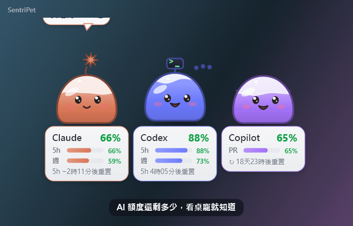
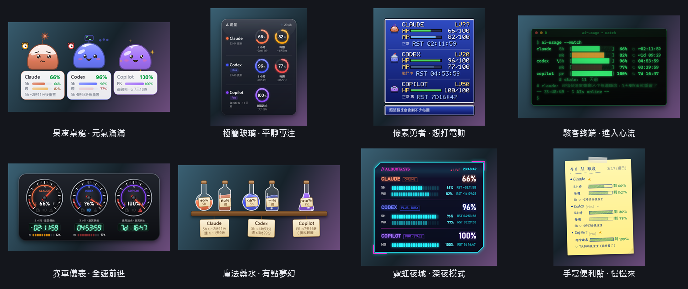
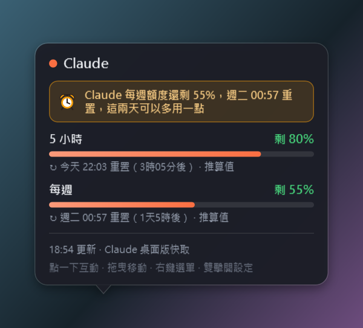
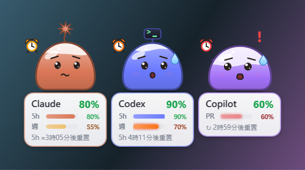
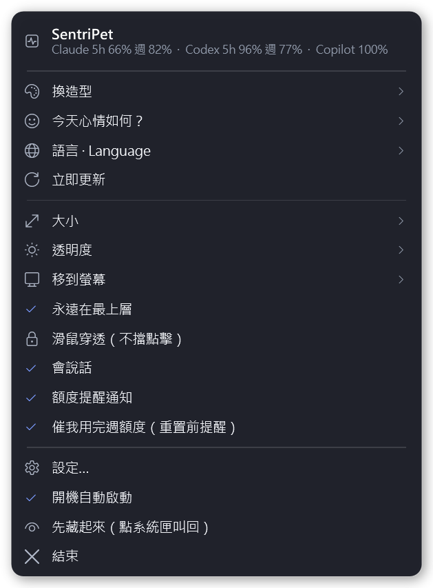
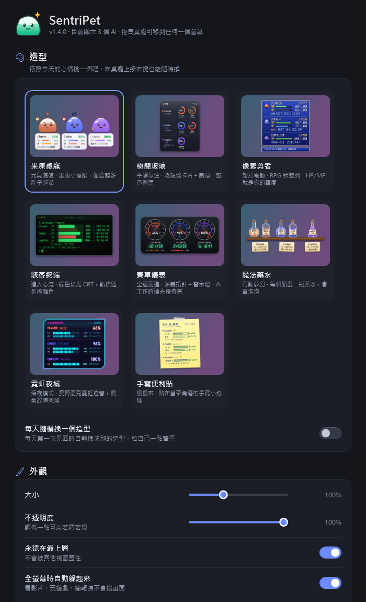
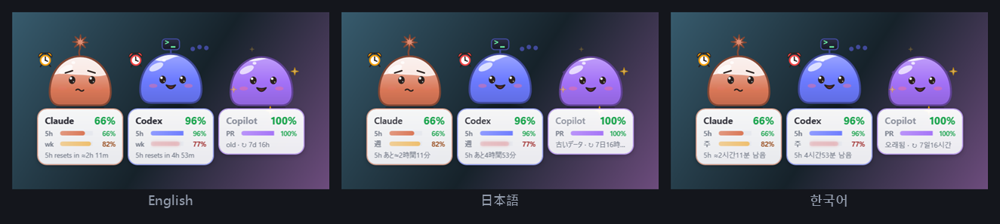

# SentriPet

[English](README.md) | **繁體中文**

[](https://github.com/daven55663/SentriPet-AI/actions/workflows/ci.yml)
[](https://github.com/daven55663/SentriPet-AI/releases/latest)
[](LICENSE)
[](docs/environment.zh-TW.md)

**SentriPet** 是放在桌面上的 AI 用量監控桌寵。它會自動偵測電腦上的 AI 工具（Claude、Codex、Copilot…），
即時顯示還剩多少額度、多久後重置，不用再一直點開「設定 → 用量」；每週額度快重置卻還沒用完時，還會催你把它用掉。
支援 **Windows、macOS、Linux**。

<p align="center"></p>

## 特色

- **一眼看到剩多少**：大數字是最短的額度（例如 5 小時），下面的小條是每週額度，還有重置倒數
- **8 種造型**，依心情切換，也可以設定每天隨機換
- **會提醒**：用量越過門檻時提醒、額度重置時慶祝；每週額度快重置卻還剩很多時，桌寵會著急地催你用掉
- **AI 做完會告訴你**：Claude Code、Codex 做完較長的任務或在等你確認時，桌寵會跳起來通知你，等待時可以放心去做別的事
- **預測與報告**：「照目前速度約 15:40 用完」、每一期週額度實際用掉多少，最近 7／30 天每天、每個專案、每個模型的 token 數與換算成
  API 的費用，還能產生一張可以分享的週報圖
- **桌寵會成長**：有計畫地把額度用好（不是用越多越好），桌寵就會升級、戴上配件、解鎖成就
- **好串接**：系統匣／選單列圖示直接顯示剩餘 %，輸出 `usage.json` 給自己的腳本或 Stream Deck，還有給 OBS 用的透明網頁
- **多國語言**：繁體中文、简体中文、English、日本語、한국어，預設跟隨系統語言
- 可以拖到任何一個螢幕；開機自動啟動；看影片、玩遊戲的全螢幕畫面時自動躲起來
- 可用 JSON 外掛接上任何 AI 服務
- **只在本機讀取**用量資料，不讀取、也不傳送任何登入憑證
- 輕量：約 110 MB 記憶體，動畫約佔單核 1～4%（在[開發環境](docs/environment.zh-TW.md)量測）

## 畫面一覽

**8 種造型**（在桌寵上按右鍵 → 換造型）

<p align="center"></p>

**滑鼠停在上面**：每個額度剩多少、什麼時候重置、資料來源與更新時間。
**額度快過期卻沒用完**：桌寵會著急（冒汗、鬧鐘、進度條閃爍），卡片上也會提醒。

<p align="center">
  
  
</p>

**右鍵選單與設定頁**（雙擊桌寵開啟設定）

<p align="center">
  
  
</p>

**多國語言**（右鍵選單 → 語言 · Language）

<p align="center"></p>

## 安裝手冊

### 用套件管理器安裝（推薦）

**Windows**（[Scoop](https://scoop.sh)）：裝好後桌寵會直接出現，之後用 `scoop update sentripet` 更新。

```
scoop bucket add sentripet https://github.com/daven55663/SentriPet-AI
scoop install sentripet
```

**macOS**（[Homebrew](https://brew.sh)）：裝到「應用程式」，之後用 `brew upgrade --cask sentripet` 更新。

```
brew tap daven55663/sentripet https://github.com/daven55663/SentriPet-AI
brew install --cask sentripet
```

Homebrew 安裝時會移除 macOS 的隔離標記，所以不會出現「無法確認開發者」的阻擋（這個 App 沒有 Apple 開發者簽章）。

### 下載安裝檔

到 **[Releases](https://github.com/daven55663/SentriPet-AI/releases/latest)** 下載最新版：

| 系統 | 檔案 | 需求 |
|---|---|---|
| Windows | `SentriPet-<版本>-win-x64.zip` | Windows 10／11 |
| macOS Apple 晶片（M1～M4） | `SentriPet-<版本>-osx-arm64.zip` | macOS 12 以上 |
| macOS Intel | `SentriPet-<版本>-osx-x64.zip` | macOS 12 以上 |
| Linux | `SentriPet-<版本>-linux-x64.tar.gz` | x64、X11 或 XWayland 桌面 |

每個檔案都已經包含執行需要的一切，不需要另外安裝 .NET。
（1.x 版的 Windows 專用版本（WPF）仍可在 [v1.4.0](https://github.com/daven55663/SentriPet-AI/releases/tag/v1.4.0) 下載，但不再更新。）

### Windows

1. 下載 `SentriPet-<版本>-win-x64.zip`，解壓縮到一個固定的資料夾（例如 `%LOCALAPPDATA%\Programs\SentriPet`）。
2. 執行 `SentriPet.exe`。如果出現「Windows 已保護您的電腦」，按「其他資訊」→「仍要執行」（程式沒有數位簽章）。
3. 桌寵出現在螢幕右下角，系統匣也會多一個果凍圖示；開始選單會多一個 SentriPet，之後開機會自動啟動（設定 → 一般 可以關）。

**從原始碼安裝**（需要 [.NET 10 SDK](https://dotnet.microsoft.com/download)）：

```
git clone https://github.com/daven55663/SentriPet-AI.git
cd SentriPet-AI
install.cmd
```

`install.cmd` 會編譯、安裝到 `%LOCALAPPDATA%\Programs\SentriPet` 並啟動；移除請執行 `uninstall.cmd`。
從 1.x 版升級時設定會保留，程式直接換成新版。

### macOS

1. 下載對應晶片的 zip（Apple 晶片選 `osx-arm64`，Intel 選 `osx-x64`），解壓縮後把 `SentriPet.app` 拖到「應用程式」。
2. **第一次開啟**：這個 App 沒有 Apple 開發者簽章，macOS 會擋下來。在終端機執行下面這行就能打開：
   ```
   xattr -dr com.apple.quarantine /Applications/SentriPet.app
   ```
   或是先開一次（會被擋），再到「系統設定 → 隱私權與安全性」往下捲，按 SentriPet 旁邊的按鈕允許打開
   （macOS 14 以前也可以在 `SentriPet.app` 上按右鍵 →「打開」）。用 Homebrew 安裝就不需要這一步。
3. 桌寵出現在桌面上，選單列會有果凍圖示（不會出現在 Dock）。第一次跳通知時，macOS 可能會問要不要允許通知。
4. 開機自動啟動用的是 `~/Library/LaunchAgents/com.sentripet.app.plist`，設定 → 一般 可以關。

### Linux

```
tar xzf SentriPet-<版本>-linux-x64.tar.gz
cd SentriPet-<版本>-linux-x64
./install.sh
```

`install.sh` 會裝到 `~/.local/share/sentripet`、加進應用程式選單並啟動（不需要 root）。

- 需要有合成器的桌面才會是透明背景（GNOME、KDE、Xfce 等大多都有）。
- GNOME 要顯示系統匣圖示，需要「AppIndicator and KStatusNotifierItem Support」擴充；沒有系統匣時用桌寵的右鍵選單即可。
- 通知用 `notify-send`（Debian／Ubuntu：`sudo apt install libnotify-bin`）。
- Linux 沒有 Claude 桌面版：要看 Claude 的用量，請在 設定 → AI 服務 開啟「連接 Claude Code 狀態列」。

### 更新與移除

- **更新**：Scoop 用 `scoop update sentripet`、Homebrew 用 `brew upgrade --cask sentripet`（先在右鍵選單按「結束」）；
  自己下載的版本，下載新版覆蓋舊的檔案即可（Linux 重新執行 `install.sh`）。設定都會保留。
- **移除**：設定 → 一般 關掉「開機自動啟動」，右鍵選單按「結束」，再執行 `scoop uninstall sentripet`／`brew uninstall --cask sentripet`，
  或刪掉程式與設定資料夾（位置見最下面的「檔案位置」）。從原始碼安裝的 Windows 版執行 `uninstall.cmd` 即可。

## 使用方式

### 第一次開啟

SentriPet 會自動找出電腦上的 AI 工具，找到的每個 AI 就是一隻桌寵，並打聲招呼。要讀到用量，需要：

- **Claude**：開著 Claude 桌面版（它每 15 分鐘記錄一次用量；有用 Claude Code 時會在兩次之間即時推算），
  或開啟 設定 → AI 服務 →「連接 Claude Code 狀態列」，直接拿 Claude Code 提供的官方數字（Linux 只能用這個方式，見下面的說明）
- **Codex**：裝了 Codex 桌面版、VS Code 擴充或 `codex` 指令，並用 ChatGPT 帳號登入
- **Copilot**：用過一次 Copilot CLI（它會留下額度快取）

沒有偵測到的 AI 可以在 設定 → AI 服務 看到原因，或寫一個[外掛](#接上其他-ai外掛)接上。

### 操作

| 動作 | 效果 |
|---|---|
| 拖曳 | 移動（靠近螢幕邊緣會吸附），位置會記住 |
| 點一下 | 桌寵會回話 |
| 滑鼠停在上面 | 顯示詳細用量、重置時間、資料來源 |
| 右鍵 | 選單：換造型（每種造型旁邊標著心情，也可以交給命運隨機換）、額度利用率（直接顯示最近 8 期與這期的長條圖和數字；「產生這週的週報圖」；「查看完整報告…」）、大小、透明度、移到螢幕、語言、暫停提醒。不常動的開關（永遠在最上層、滑鼠穿透、會說話、提醒通知、催我用完週額度、開機自動啟動）在設定頁 |
| 雙擊 | 開啟設定 |
| 系統匣／選單列圖示 | 左鍵顯示／隱藏，右鍵選單（滑鼠穿透時從這裡關掉）。圖示裡的果凍高度 = 最低的剩餘額度；開啟「系統匣／選單列圖示顯示剩餘 %」後圖示直接是那個數字，顏色跟著變；AI 工作中會多一個藍點 |

### 設定頁

| 分區 | 可以做什麼 |
|---|---|
| 造型 | 看 8 種造型的即時預覽並切換；每天隨機換一個 |
| 外觀 | 大小、不透明度、永遠在最上層、全螢幕時躲起來、滑鼠穿透、會說話、自訂台詞、省電模式、系統匣圖示顯示剩餘 %、只顯示在系統匣（桌面上不放桌寵） |
| AI 服務 | 每個 AI 偵測到什麼、目前讀到的數字；開關個別 AI；Codex 即時查詢頻率；Claude 每週重置時間、Claude Code 狀態列、「AI 做完或在等你時提醒」、即時推算 |
| 提醒 | 額度提醒通知、「催我用完週額度」、勿擾時段、提醒與緊急門檻 |
| 額度利用率 | 每個額度最近 8 期（週／月）用掉多少與平均；重置時跳通知總結；打開用量報告 |
| 成長與成就 | 開關養成、等級與經驗值、10 個成就與目前的進度 |
| 給其他程式用 | 輸出 `usage.json` 給腳本、給 OBS 用的本機網頁（[格式與選項](docs/usage-json.zh-TW.md)） |
| 一般 | 語言、開機自動啟動、開啟設定／記錄檔／程式資料夾 |

### 看懂畫面

- **大數字**固定顯示最短的額度（Claude、Codex 是 5 小時），不會在 5 小時和每週之間跳來跳去；每週額度看下面的小條。
  桌寵的表情跟著最吃緊的那個額度：額度多時開心、少時冒汗、用完就睡覺。
- 下面那行是重置倒數，會標明是哪個額度（`5h 2時11分後重置`）；5 小時還沒開始計時時，改顯示每週的重置時間。
- 數字前面有 **≈**（Windows 上顯示 **~**）表示是推算值：Claude 桌面版兩次紀錄之間，用 Claude Code 的 token 用量即時推算。
- 資料舊了（例如 Copilot CLI 很久沒用）會標「舊資料」。

### 「快用掉」提醒

每週／每月額度快重置、卻還剩不少時，桌寵會著急地催你把它用掉，不然就浪費了。畫面上不多加文字：
快過期的那條進度條會閃，桌寵的表情會變；詳細說明在滑鼠停上去的卡片裡。

| 距離重置 | 還剩 | 桌寵的反應 |
|---|---|---|
| 2 天內 | 30% 以上 | 進度條慢慢閃，眉毛上揚、偷瞄旁邊的鬧鐘，約每小時說一次 |
| 最後一天 | 10% 以上 | 進度條閃得更快，張大嘴冒汗，鬧鐘一響就嚇一跳，約每 25 分鐘說一次 |
| 最後 6 小時 | 5% 以上 | 進度條快閃，慌張發抖、鬧鐘狂響，約每 12 分鐘說一次 |

每升一級會跳一次通知（重開機也不會重複跳）。AI 正在工作時不會打擾你（桌寵會開心地看你用）；
5 小時額度用完時也先不催（反正用不了）。設定 → 提醒 →「催我用完週額度」可以關掉。

### 「AI 做完或在等你」（Claude Code、Codex）

開啟 設定 → AI 服務 →「AI 做完或在等你時提醒」後，Claude Code 做完較長的任務（超過 30 秒，平常一問一答不會吵你）、
要你確認或在等你回覆時，還有 Codex 每回合做完時，那隻桌寵會跳起來告訴你。「同時跳通知」會再加一則通知。
會修改哪些設定見「常見問題」。

### 用完預測、額度利用率週報、勿擾時段

- **用完預測**：額度正在使用時，懸停卡片會顯示照最近一小時的速度（每週額度看最近六小時）大約幾點用完（重置前用不完就不顯示）；
  剩 45 分鐘時桌寵會提醒一次。
- **額度利用率週報**：每週／每月額度重置時，桌寵會說這一期用掉多少（「用掉 82%，只浪費一點點！」）；
  設定 →「額度利用率」可以看每個額度最近 8 期的長條圖與平均。
- **勿擾時段**：設定 → 提醒（例如 22:00–08:00、可選星期幾），或右鍵選單「暫停提醒 1 小時」。
  這段時間不跳通知、桌寵不主動說話，點牠還是會回應。

### 用量報告與週報圖

右鍵選單 → 額度利用率 →「查看完整報告…」（或 設定 → 額度利用率 →「打開用量報告」）會開一個視窗：

- **額度利用率**：每個週／月額度過去幾期與這一期的長條圖。
- **每天用了多少 token**：最近 7 或 30 天，來自 Claude Code 與 Codex 的本機紀錄（輸入、輸出、快取讀寫合計；只讀數字、模型和資料夾名稱，
  不讀對話內容），依 AI 分色堆疊。
- **專案排行**與**模型**：同一段期間。
- **API 等值費用**：token 數乘上官方 API 價格（價格表附查詢日期與來源，內建在程式裡；設定資料夾放一份 `prices.json` 就會改用它）。
  只是比較用：訂閱方案和 API 的計價方式不同；價格表上沒有的模型會列出來，不會亂猜。

「產生這週的週報圖」會存一張 1200 × 675 的 PNG 到「圖片／SentriPet」：這週的 token 數、API 等值費用、最常用的模型、
額度利用率和小圖表，再加上你的桌寵，可以直接貼到社群。

### 系統匣、腳本、直播

- **系統匣直接顯示數字**：設定 → 外觀 →「系統匣／選單列圖示顯示剩餘 %」，圖示就是最低的剩餘 %，顏色綠／黃／紅。
  「只顯示在系統匣／選單列」會把桌寵從桌面收起來，要看時點一下圖示。
- **usage.json**：設定 → 給其他程式用 →「輸出 usage.json」，會在設定資料夾持續更新每個 AI 的剩餘 %、重置時間、是否正在工作；
  有版本號，之後改格式也不會弄壞你的腳本。
- **OBS**：「直播畫面（OBS）」會在 `http://127.0.0.1:47291/` 提供透明背景的網頁，加到 OBS 的「瀏覽器來源」就有用量條，
  網址加上 `?view=pet` 則顯示桌寵。只有這台電腦連得到。

`usage.json` 的格式、網頁的選項與腳本範例見 [docs/usage-json.zh-TW.md](docs/usage-json.zh-TW.md)。

### 養成與成就

把額度用好，桌寵就會成長。每一期週／月額度結束時會得到經驗值：用到 90% 以上**而且沒有在重置前很久就用完**最多；
太早用完（卡了一整天）拿到的比用到 70～90% 還少，所以重點是有計畫地用，不是用越多越好。每天打開桌寵也會加一點，
另外還有 10 個成就（「精準規劃」、連續 4 期用到 80% 以上的「不浪費」、「重新振作」、「天天見」……）。

等級會顯示在懸停卡片上；果凍桌寵會依等級戴上蝴蝶結（Lv 2）、星星徽章（4）、小花（6）、皇冠（8）和金色光芒（10）。
設定 →「成長與成就」可以看經驗值和每個成就，也可以在那裡關掉。第一次開啟 2.4 時，週報裡已經有的紀錄也會算進去。

### 自訂台詞

設定 → 外觀 → 自訂台詞 →「開啟台詞檔」會在設定資料夾建立 `lines.json`：點桌寵、額度快用完、Claude Code 做完時……
桌寵要說什麼都可以自己寫，依語言分組，記號和內建台詞一樣（`{name}`、`{pct}`、`{reset}`……）。沒寫到的事件沿用內建台詞，
`"mix": true` 會兩種混著說。記號打錯的那一句會被略過，設定頁會說是哪一句。事件與記號見 [docs/custom-lines.zh-TW.md](docs/custom-lines.zh-TW.md)。

### 語言

支援 **繁體中文、简体中文、English、日本語、한국어**。預設「自動」＝跟隨系統的顯示語言
（繁中地區用繁體、中國／新加坡用簡體、日文、韓文，其他語言用英文）。

- 切換：右鍵選單 → **語言 · Language**，或 設定 → 一般 → 語言。立即生效，不用重開。
- 選單、設定頁、詳情卡、桌寵說的話、造型名稱、通知都會換成該語言，字型也會跟著換。
- 設定 → Claude 每週重置時間 可以用任何一種語言填：`週四 23:00`、`周四 23:00`、`Thu 23:00`、`木曜日 23:00`、`목요일 23:00`。

想新增或修正翻譯：程式裡的繁體中文就是原文，翻譯放在 `src/Lang/<語言>.json`（`"原文": "翻譯"`，
`{0}`、`{name}` 這類記號要保留）。自動測試會檢查每一句都有翻譯、記號一致。

## 常見問題

**沒有偵測到 Claude／Claude 顯示「找不到用量紀錄」**
開啟 Claude 桌面版就會開始記錄。Linux 沒有 Claude 桌面版：請開啟「連接 Claude Code 狀態列」（見下一題）。

**「連接 Claude Code 狀態列」是什麼？**
Claude Code 每次回覆後，會把官方的用量與重置時間交給它的「狀態列指令」。開啟這個選項後，SentriPet 會在
`~/.claude/settings.json` 把自己設成狀態列指令（修改前會備份成 `settings.json.sentripet-backup`），記下官方數字：

- Linux 上靠它才讀得到 Claude 用量；Windows／macOS 上重置時間會變成官方的（不再是推算值）。
- 你原本的狀態列照常顯示（SentriPet 會代為執行原本的指令）；沒有的話，狀態列會顯示剩餘額度。關掉選項就會原封不動還原。
- 數字只在使用 Claude Code 時更新；只在 claude.ai 網頁、手機或桌面版聊天的用量，要等下次用 Claude Code 才會反映出來。
- 需要 Pro 或 Max 訂閱（用 API 金鑰時 Claude Code 不會提供這些數字）。

**「AI 做完或在等你時提醒」會改哪些設定？**
會在 `~/.claude/settings.json` 把 SentriPet 加成 hook（`Stop`，以及要你確認、在等你輸入時的 `Notification`），
並在 `~/.codex/config.toml` 設成 `notify` 程式（有裝哪一個就改哪一個）。修改前都會先備份（`….sentripet-backup`）；
你原本的 hooks 會保留，原本就有的 `notify` 程式也照常執行（SentriPet 會用同樣的輸入代為執行）。關掉選項就會還原。
hook 不會印出任何東西，也一定讓 Claude Code 照常繼續。

**Claude 的重置時間和官網差一點**
Claude 桌面版的紀錄裡沒有重置時間，是用歷史紀錄推算的。開啟「連接 Claude Code 狀態列」就會用官方的時間；
或到 設定 → AI 服務 → Claude 每週重置時間，照 Claude「設定 → 用量」頁面寫的時間填一次（例如 `週四 23:00`）。

**在 claude.ai 網頁或手機上聊天，數字沒有馬上變**
那部分只能等 Claude 桌面版下一次更新紀錄（約 15 分鐘）。

**桌寵擋到要點的東西**
設定 → 外觀 開「滑鼠穿透」，點擊會直接穿過桌寵；要關掉請在系統匣圖示按右鍵。也可以調小一點或移到別的螢幕。

**全螢幕時桌寵不見了**
這是「全螢幕時自動躲起來」（Windows、Linux），離開全螢幕就會回來；不想要可以在 設定 → 外觀 關掉。
macOS 的全螢幕 App 會在自己的桌面空間裡，桌寵本來就不會出現在那裡。

**不小心藏起來了**
點系統匣圖示，或再開一次程式（已經在執行時會把桌寵叫回來）。

**macOS 說「無法打開，因為無法確認開發者」**
見上面 macOS 安裝第 2 步，或改用 Homebrew 安裝。

**Windows 出現「Windows 已保護您的電腦」**
程式沒有數位簽章，按「其他資訊」→「仍要執行」。用 Scoop 安裝不會出現這個畫面。

## 資料從哪裡來（全部在本機，不讀、不傳任何登入憑證）

| AI | 來源 | 更新頻率 |
|---|---|---|
| Claude | Claude 桌面版自己記錄的 `plan-usage-history.json`（和「設定 → 用量」同一份數字），加上 Claude Code 本機對話紀錄裡的 token 數（只讀數字，不讀內容）；開啟「連接 Claude Code 狀態列」時，另外使用 Claude Code 交給狀態列的官方用量與重置時間 | 桌面版約每 15 分鐘寫一次；兩次之間用 Claude Code 的 token 用量即時推算（比例會用你自己的歷史紀錄自動校準，實測誤差約 1 個百分點）；狀態列在 Claude Code 每次回覆後更新 |
| Codex | 官方 `codex app-server` 的 `account/rateLimits/read`，加上 `~/.codex/sessions` 對話紀錄裡的 rate_limits | 預設每 5 分鐘即時查詢一次；用 Codex 時本機紀錄會即時更新 |
| Copilot | Copilot CLI 的額度快取 | 用 Copilot CLI 時才會更新 |
| Ollama | 本機 `http://127.0.0.1:11434`（沒有額度，只顯示載入中的模型） | 30 秒 |
| 其他 | Gemini CLI、Cursor、Windsurf、LM Studio… 會被偵測到並列在設定裡；可以用外掛接上用量 | — |

## 接上其他 AI（外掛）

在設定資料夾的 `providers` 裡放一個 JSON 設定檔就能新增一隻桌寵，
支援「執行一支程式印出 JSON」、「呼叫 HTTP API」、「讀取 JSON 檔」三種方式。
說明與範例：[`examples/providers/README.md`](examples/providers/README.md)（設定 → AI 服務 → 開啟外掛資料夾，會自動複製範例過去）。

## 開發

SentriPet 用 C#（.NET 10）與 [Avalonia](https://avaloniaui.net/) 寫成，一份程式碼在 Windows、macOS、Linux 上執行。
2.0 以前的 Windows 專用版本（WPF）在 git 標籤 `v1.4.0`。

```
src/Core、src/Providers   用量模型、各 AI 的資料來源、提醒、翻譯（不含任何畫面程式）
src/Lang                   翻譯檔
src/Tests                  核心測試
xplat/SentriPet.Desktop    桌寵本體：8 種造型、詳情卡、設定頁、系統匣、各系統整合（Integration.cs）
xplat/SentriPet.Tests      核心測試的執行程式
```

需要 [.NET 10 SDK](https://dotnet.microsoft.com/download)：

```
dotnet build SentriPet.slnx -c Release
dotnet run -c Release --project xplat/SentriPet.Desktop            執行
dotnet run -c Release --project xplat/SentriPet.Desktop -- --dev   獨立的設定檔，不碰開機啟動
xplat/package.sh win-x64                                           打包（osx-arm64、osx-x64、linux-x64 也可以）
```

- 新增造型：在 `xplat/SentriPet.Desktop/Themes` 新增一個繼承 `Theme` 的類別，並加到 `ThemeCatalog.All`。
- 新增內建 AI：在 `src/Providers` 新增一個繼承 `Provider` 的類別，並加到 `ProviderRegistry`。
- `--lang en`：指定語言（`zh-TW`、`zh-CN`、`en`、`ja`、`ko`）；`--dev --show-detail claude`：強制顯示某隻的詳情卡 45 秒。
- `--snapshot 資料夾`：用範例資料把所有造型、詳情卡、泡泡、設定頁畫成 PNG（不需要螢幕）。
- `--demo 檔案.gif --lang zh-TW`：產生 README 上的示範動畫（`docs/images/demo*.gif`）。
- `--probe 檔案`：輸出偵測與用量報告；`--dev --perf-test 檔案`：量測每種造型的 CPU。

### 自動測試、CI 與發佈

| 測試 | 內容 | 數量 |
|---|---|---|
| `xplat/SentriPet.Tests` | 核心、每個資料來源（範例檔與本機假伺服器，不碰真實資料）、提醒、勿擾時段、用完預測、週報、token 帳本、API 價格、usage.json 與本機網頁伺服器、翻譯、Claude Code 狀態列與 hooks、Codex notify | 556 項 |
| `SentriPet --selftest 報告.txt` | 8 種造型、果凍的表情、詳情卡與擺放位置、泡泡、選單、設定頁、用量報告、週報圖、系統匣圖示、OBS 用的桌寵畫面、語言、開機啟動、通知、單一執行、示範動畫、縮放繪製、hook 指令 | 115 項 |
| `SentriPet --dev --smoke-test 報告.txt` | 真的開啟程式 15 秒：視窗有出來、在螢幕內、第一次在右下角、有在動畫、系統匣、OBS 網頁真的用 HTTP 回應、沒有錯誤 | 9 項 |

每次推送，[CI](https://github.com/daven55663/SentriPet-AI/actions/workflows/ci.yml) 會在 Windows、macOS、Linux 上編譯、跑全部測試
（Linux 用虛擬螢幕真的開一次程式）、畫出所有造型的截圖，並打包各系統的安裝檔（在該次執行的 Artifacts）。
推送 `v*` 標籤時，[Release](.github/workflows/release.yml) 流程會在各系統打包、讓每個安裝檔先跑一次自我測試，全部通過才發佈；
發佈後自動更新 Scoop、Homebrew、winget 的安裝設定（`bucket/`、`Casks/`、`packaging/winget/`），
再用 Scoop 和 Homebrew 實際安裝一次、跑自我測試（[Package managers](.github/workflows/packages.yml)）。
開發紀錄見 [docs/DEVLOG.md](docs/DEVLOG.md)，開發與測試用的電腦和工具見 [docs/environment.zh-TW.md](docs/environment.zh-TW.md)。

## 檔案位置

| | Windows | macOS | Linux |
|---|---|---|---|
| 程式 | `%LOCALAPPDATA%\Programs\SentriPet\` | `/Applications/SentriPet.app` | `~/.local/share/sentripet/` |
| 設定與記錄檔 | `%APPDATA%\SentriPet\` | `~/Library/Application Support/SentriPet/` | `~/.config/SentriPet/` |
| 外掛 | `%APPDATA%\SentriPet\providers\` | `~/Library/Application Support/SentriPet/providers/` | `~/.config/SentriPet/providers/` |
| 開機啟動 | 登錄檔 `HKCU\…\Run` 的 `SentriPet` | `~/Library/LaunchAgents/com.sentripet.app.plist` | `~/.config/autostart/sentripet.desktop` |
| 選單捷徑 | 開始選單的 `SentriPet` | — | `~/.local/share/applications/sentripet.desktop` |

設定檔是 `settings.json`，記錄檔是 `logs/app.log`；開啟「輸出 usage.json」時還有 `usage.json`，自訂台詞是 `lines.json`，額度利用率與養成紀錄是 `report.json`、`progress.json`。週報圖存在「圖片／SentriPet」。1.0 版叫「AI 用量桌寵」，資料在 `%APPDATA%\AIUsagePet`；升級時會自動把設定搬過來。

## 授權

[MIT](LICENSE) © 2026 歐育典
